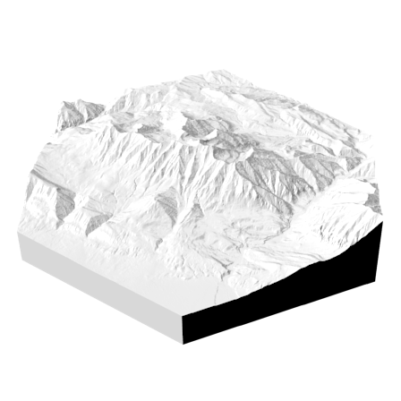

# Terraform: generate 3-d models of geographic terrain

## Running:

`topo.bin`

## Dependencies

- GDAL, which is a C library that will need to be installed separately. On macos, try `brew install gdal2` or `brew install gdal`.
- Rust. This was developed with rustc 1.34.1 (2019-04-24), and cargo 1.34.0 (2019-04-01). It is probably compatible with some other versions.

## Building

`env GDAL_LIB_DIR=/usr/local/opt/gdal/lib/ cargo run --release` should do the trick.

Note that because of the intensive numerical processing involved, doing a debug build will only result in sadness.

## Use

Check out the blog post that I'm about to write.

### Finding a Data Source
There are a number of free, public data sources out there with relatively
high-resolution elevation data for various parts of the world. The one that's
easiest to use, and conveniently doesn't require you to register, is the USGS
National Map (this only works if the area you're interested in is within the
US, however). It provides "1/3 arc-second resolution" -- e.g. an elevation
reading for every 10 meters. [Here's a
link](https://viewer.nationalmap.gov/basic/?basemap=b1&category=ned&q=&zoom=11&bbox=-111.99426681,40.14528109,-111.23003036,40.59204857&preview=&avail=&refpoly=)
to the map viewer zoomed to Mount Timpanogos in Utah.

The other data source I looked at was the "ALOS Global Digital Surface
Model", also referred to as the "AW3D30", which is provided by the Japanese
government, and has "1 arc-second resolution" data (every 30 meters), for the
whole world. You have to register with them to access it, but it's free &
fairly painless to do so. You register [at this
page](https://www.eorc.jaxa.jp/ALOS/en/aw3d30/registration.htm), and then
they email you a password to use [on the map viewer
page](https://www.eorc.jaxa.jp/ALOS/en/aw3d30/data/index.htm).

### Importing elevation data

If you got the data from USGS National Map, you'll need to unzip the archive, and find the `.adf` file that's the largest (it wiwll probably look somelike like `x001001.adf`).

If you got the data from ALOS AW3D30, you'll want to open the `.tif` file that ends in `_DSM.tif`.

Open Terraform, click "open file", and select the `.adf` or `.tif` file that you want. If the program crashes, you probably picked an invalid file.

### Crop to the section you care about

Cropping to a smaller rectangle than the full initial file allows Terraform to render at a higher resolution & show you more detail for the final cut.

### Cut to a hexagon

Currently terraform only supports hexagons for the final cut, but I could imagine supporting cylinders, rectangles and triangles in the future.

### Export!

This will generate a `.stl` mesh file, which can be imported into Blender, AutoCAD, FreeCAD, etc. for 3-d printing or (maybe) cnc routing!
